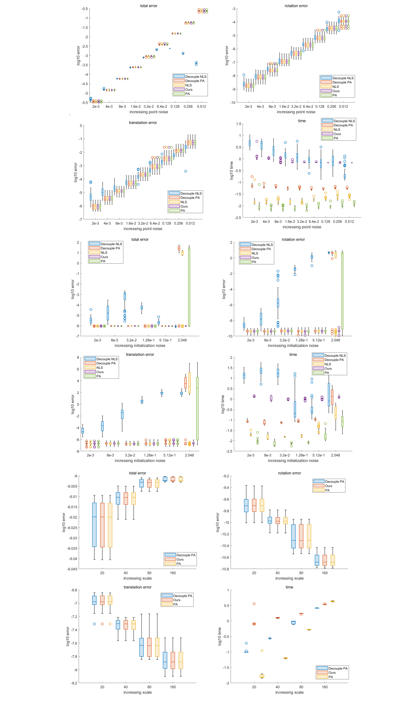

<p align="center">
  <h1 align="center"> <ins>GlobalPointer</ins> ⚡️<br>Large-Scale Plane Adjustment with Bi-Convex Relaxation</h1>
</p>

<a href="https://arxiv.org/abs/2407.13537"></a>
<a href="https://bangyan101.github.io/GlobalPointer/"></a>
<a href="https://www.youtube.com/watch?v=zWXM-a8ZLaI"></a>

This is the official implementation of our ECCV 2024 paper, [**GlobalPointer**: Large-Scale Plane Adjustment with Bi-Convex Relaxation](https://bangyan101.github.io/GlobalPointer/).


## Requirement
1. MATLAB r2023a
2. YALMIP [Version R20230622](https://yalmip.github.io/R20230622)
3. MOSEK [Version 10.1.11](https://www.mosek.com/downloads/10.1.11/)


## Replace TODO codes
1. Find our main MATLAB script in **main/sythetic_main.mlx** and replace the following code.

2. Replace `PATH_TO_YALMIP` and `PATH_TO_MOSEK` with the paths to your own YALMIP and MOSEK solvers, respectively.

3. Replace `PATH_TO_PROJECT` with the path to your project root.
```
% ---------------------- TODO ----------------------
addpath(genpath("PATH_TO_YALMIP\YALMIP-master"))
addpath(genpath("PATH_TO_MOSEK\Mosek\10.1\toolbox\r2017a"))
root_path = "PATH_TO_PROJECT\GlobalPointer\";
addpath(genpath(root_path))
% ---------------------- TODO END ----------------------
```


## Select experiment 
We provide three full experiment setups:
- Increasing point cloud noise
- Increasing pose initialization noise
- Increasing the number of poses and planes
```
% ---------------------- Experiment Selection Setup ----------------------
% please select your experiment setup
param.increasing_point_noise = false;
param.increasing_pose_noise = false;
param.increasing_scale = true;
% ---------------------- Experiment Selection Setup END ----------------------
```


## Example results

These are example results after running the above code. As shown in these figures, we test our method against the classical nonlinear least-squares method, the classical plane adjustment method, and their decoupled variants.


## Citation

If you find our work useful in your research, please consider citing:

```
@inproceedings{Liao2024GlobalPointer,
    author 	= {Bangyan Liao and Zhenjun Zhao and Lu Chen and Haoang Li and Daniel Cremers and Peidong Liu},
    title 	= {GlobalPointer: Large-Scale Plane Adjustment with Bi-Convex Relaxation},
    booktitle = {European Conference on Computer Vision (ECCV)},
    year 	= 2024,
    keywords = {Plane Adjustment, Semidefinite Programming (SDP), Convex Relaxation}
}
```
